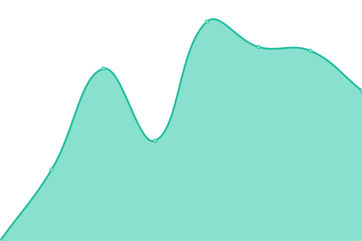

# [📈 Live Status](https://status.inguva.dev): <!--live status--> **🟧 Partial outage**

This repository contains the open-source uptime monitor and status page for [mrslackit](https://status.inguva.dev), powered by [Upptime](https://github.com/upptime/upptime).

With [Upptime](https://upptime.js.org), you can get your own unlimited and free uptime monitor and status page, powered entirely by a GitHub repository. We use [Issues](https://github.com/chanderinguva/upptime/issues) as incident reports, [Actions](https://github.com/chanderinguva/upptime/actions) as uptime monitors, and [Pages](https://status.inguva.dev) for the status page.

<!--start: status pages-->
<!-- This summary is generated by Upptime (https://github.com/upptime/upptime) -->
<!-- Do not edit this manually, your changes will be overwritten -->
<!-- prettier-ignore -->
| URL | Status | History | Response Time | Uptime |
| --- | ------ | ------- | ------------- | ------ |
|  [Airflow](https://airflow.inguva.dev) | 🟥 Down | [airflow.yml](https://github.com/chanderinguva/upptime/commits/HEAD/history/airflow.yml) | 

 1082ms
     
 | 

<a href="https://status.inguva.dev/history/airflow">38.26%</a>
    

|  [Okta Login](https://login.inguva.dev) | 🟥 Down | [okta-login.yml](https://github.com/chanderinguva/upptime/commits/HEAD/history/okta-login.yml) | 

 0ms
     
 | 

<a href="https://status.inguva.dev/history/okta-login">0.00%</a>
    

|  [Blog](https://blog.inguva.dev) | 🟩 Up | [blog.yml](https://github.com/chanderinguva/upptime/commits/HEAD/history/blog.yml) | 

 346ms
     
 | 

<a href="https://status.inguva.dev/history/blog">92.51%</a>
    

|  [Jira](https://inguva-dev.atlassian.net) | 🟥 Down | [jira.yml](https://github.com/chanderinguva/upptime/commits/HEAD/history/jira.yml) | 

 629ms
     
 | 

<a href="https://status.inguva.dev/history/jira">87.32%</a>
    

|  [SCIM Server](https://airflow.inguva.dev/scim/health) | 🟥 Down | [scim-server.yml](https://github.com/chanderinguva/upptime/commits/HEAD/history/scim-server.yml) | 

 149ms
     
 | 

<a href="https://status.inguva.dev/history/scim-server">38.60%</a>
    

|  [API Gateway](https://api.inguva.dev/health) | 🟥 Down | [api-gateway.yml](https://github.com/chanderinguva/upptime/commits/HEAD/history/api-gateway.yml) | 

 134ms
     
 | 

<a href="https://status.inguva.dev/history/api-gateway">38.93%</a>
    

<!--end: status pages-->

[**Visit our status website →**](https://status.inguva.dev)

## 📄 License

- Powered by: [Upptime](https://github.com/upptime/upptime)
- Code: [MIT](./LICENSE) © [Anand Chowdhary](https://anandchowdhary.com), supported by [Pabio](https://pabio.com)
- Data in the `./history` directory: [Open Database License](https://opendatacommons.org/licenses/odbl/1-0/)
